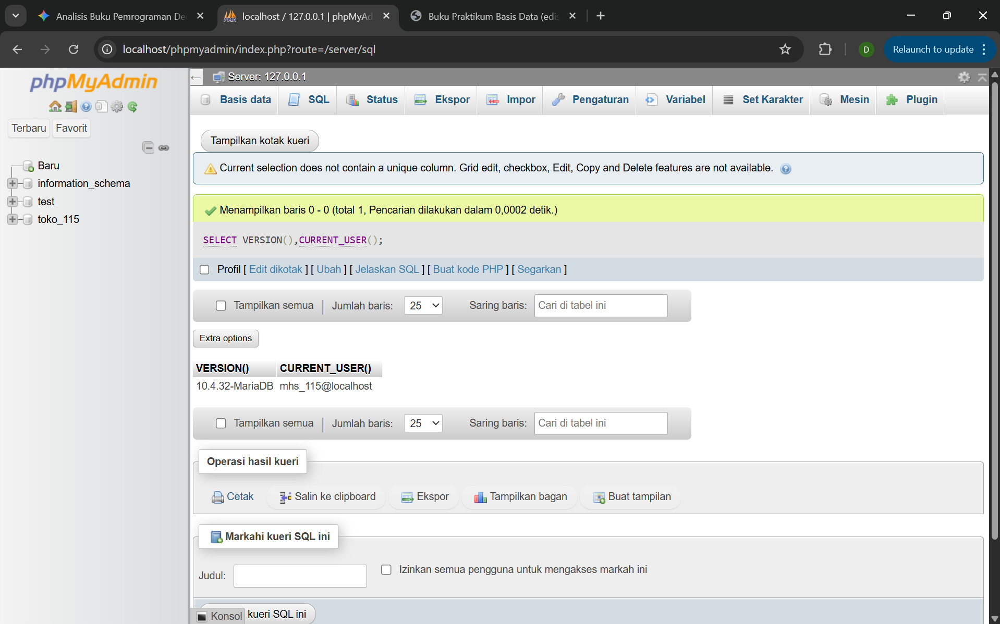
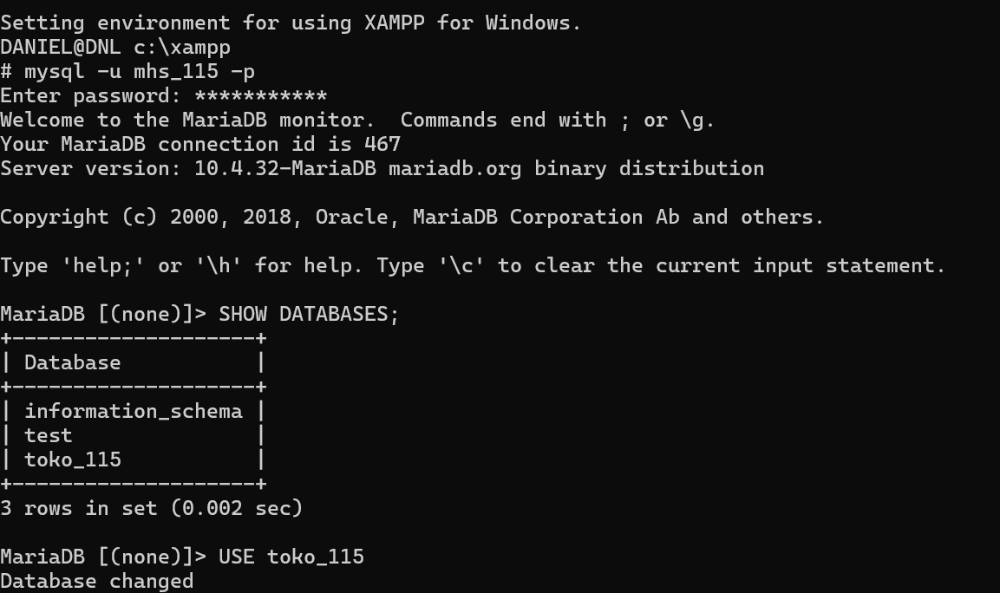
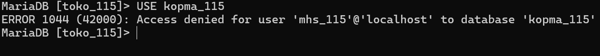
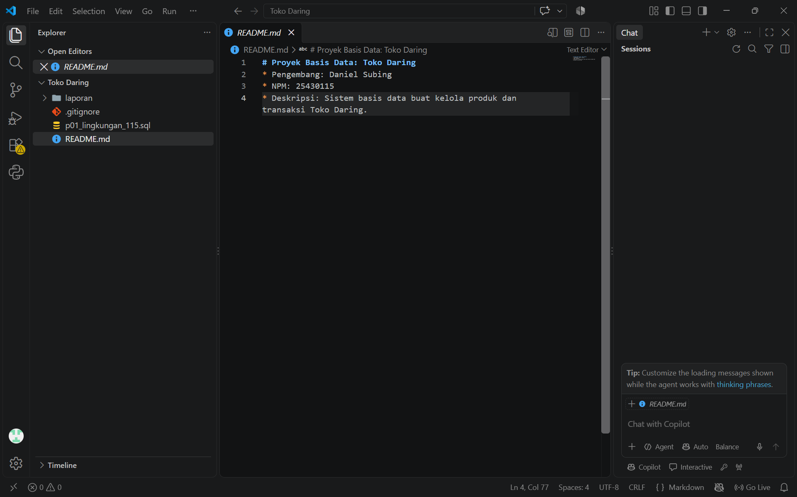
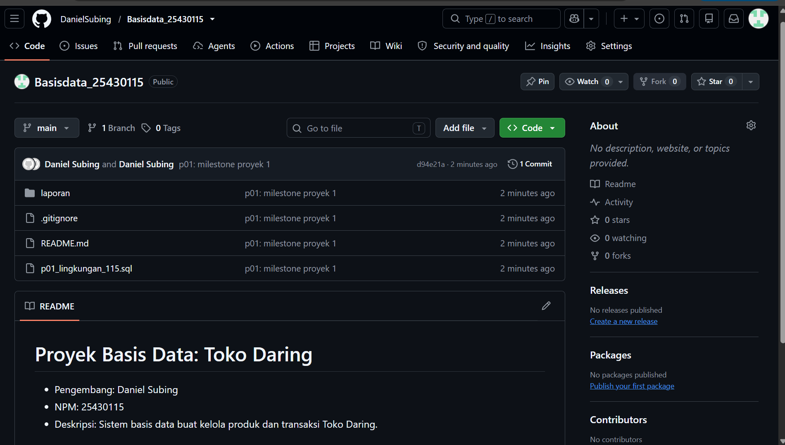

Laporan Praktikum Basis Data - Pertemuan 01

Nama: Daniel Subing

NPM: 25430115

Kelas: D

Pertemuan: 1

Tanggal Pelaksanaan: 4 Oktober 2026

Dosen Pengampu: Dedi Irawan, S.Kom., M.T.I.

1. Tujuan Praktikum

Menyiapkan instalasi lingkungan MariaDB dengan pengkodean utf8mb4 dan kolasi utf8mb4_unicode_ci.

Merancang hak akses akun pengguna mhs_115 dan tamu_115 sesuai asas hak akses minimal (least privilege).

Memverifikasi pembatasan keamanan sistem melalui pengujian pemunculan galat 1044 dan 1142.

Mengelola struktur berkas proyek secara terstruktur menggunakan Git dan repositori daring GitHub.

2. Ringkasan Dasar Teori

Manajemen hak akses pengguna merupakan fondasi keamanan basis data untuk mencegah modifikasi skema secara tidak sengaja maupun ancaman injeksi SQL. Penggunaan akun administratif root wajib dihindari untuk koneksi aplikasi harian. Standar karakter utf8mb4 menjamin penyimpanan data teks multibahasa dan simbol modern 4-byte tersimpan utuh tanpa risiko terpotong. Selain itu, mode autentikasi berbasis cookie pada antarmuka manajemen basis data dan pengaktifan SQL mode ketat menjamin konsistensi dan integritas transaksi data.

3. Langkah Percobaan (D)

Konfigurasi awal server MariaDB dan phpMyAdmin dengan mode autentikasi cookie berhasil diuji. Kueri SELECT VERSION(), CURRENT_USER(); memverifikasi sesi pengguna yang aktif, kueri SELECT @@sql_mode; mengonfirmasi penerapan validasi data ketat, dan SHOW DATABASES; membuktikan isolasi hak akses database pada sistem.

4. Titik Analisis

Analisis Titik 1–4

Larangan Penggunaan Akun Root untuk Aplikasi Harian:

Akun root memiliki wewenang administratif mutlak atas seluruh server basis data. Jika aplikasi dikoneksikan menggunakan root dan mengalami insiden kebocoran celah keamanan, penyerang dapat menghapus basis data lain, memanipulasi konfigurasi server, atau mengakses sistem berkas lokal tanpa batasan.

Perbedaan Set Karakter utf8 dan utf8mb4:

Set karakter utf8 standar di MySQL/MariaDB hanya mengalokasikan memori maksimal 3 byte per karakter, sehingga tidak mampu memproses karakter Unicode tingkat lanjut. Standar utf8mb4 mendukung penuh alokasi 4 byte, menjamin karakter multibahasa dan emoji tersimpan sempurna tanpa merusak representasi data.

Pentingnya Pemisahan Akun mhs_<3d> dan dev_<3d>:

Pemisahan ini menegakkan prinsip pemisahan wewenang (separation of duties). Akun dev_115 memiliki wewenang mengelola struktur tabel (DDL), sedangkan akun operasional biasa hanya diberi izin manipulasi data (DML), sehingga meminimalkan risiko salah ubah skema pada tingkat aplikasi.

Fungsi Autentikasi Cookie phpMyAdmin dan Ketatnya sql_mode:

Mode autentikasi cookie mengharuskan pengguna login secara berkala melalui formulir sesi terenkripsi dan tidak menyimpan kredensial terbuka pada berkas web server. Mode SQL ketat (STRICT_TRANS_TABLES) menjamin keabsahan data masuk dengan menolak tegas kueri yang tidak sesuai batasan skema tabel.

Perbedaan Kode Galat (Error Code)

Galat 1044 (ER_DBACCESS_DENIED_ERROR): Terjadi saat akun pengguna yang valid mencoba memilih atau memanipulasi basis data yang hak aksesnya tidak diberikan oleh server.

Galat 1045 (ER_ACCESS_DENIED_ERROR): Terjadi pada tahap awal autentikasi (login) akibat kegagalan pencocokan nama pengguna, host asal, atau kata sandi.

Galat 1142 (ER_TABLEACCESS_DENIED_ERROR): Terjadi saat pengguna berhasil mengakses suatu basis data, namun dilarang mengeksekusi jenis perintah tertentu (seperti CREATE TABLE atau DELETE) pada tingkatan tabel objek.

5. Latihan (E)

Pembuatan Akun Tamu dan Pengujian Galat 1142:

Sesuai latihan E.1, akun tamu_115 dibuat dengan batasan wewenang hanya perintah SELECT pada basis data kopma_115. Saat akun ini mencoba menjalankan perintah CREATE TABLE uji (id INT);, server MariaDB menolak eksekusi dan memunculkan galat 1142 (CREATE command denied to user 'tamu_115'@'localhost' for table 'uji'), membuktikan bahwa restriksi hak akses tingkat tabel berfungsi optimal.

Skrip Idempotent (E.2):

Skrip p01_lingkungan_25430115.sql dirancang agar dapat dieksekusi berulang kali tanpa menghasilkan galat duplikasi dengan menerapkan klausa CREATE DATABASE IF NOT EXISTS dan CREATE USER IF NOT EXISTS.

6. Tugas Mandiri: Milestone Proyek 1 (F)

Proyek yang dikembangkan adalah sistem basis data Toko Daring dengan skema utama toko_115 dan akun pengembang mhs_115.

A. Keputusan Desain

Menggunakan set karakter utf8mb4 dengan kolasi utf8mb4_unicode_ci agar katalog barang Toko Daring dapat menampung nama produk dengan simbol khusus dan karakter multibahasa secara konsisten.

Akun pengembang mhs_115 hanya diberikan hak penuh atas basis data toko_115 untuk menjamin isolasi data terhadap basis data lainnya di dalam DBMS.

B. Perintah SQL Konfigurasi Lingkungan

CREATE DATABASE IF NOT EXISTS toko_115 
  CHARACTER SET utf8mb4 
  COLLATE utf8mb4_unicode_ci;

CREATE USER IF NOT EXISTS 'mhs_115'@'localhost' 
  IDENTIFIED BY 'danielkeren';

GRANT ALL PRIVILEGES ON toko_115.* TO 'dev_115'@'localhost';
FLUSH PRIVILEGES;

C. Bukti Pengujian Akses dan sql_mode

Pengujian dilakukan dengan masuk ke sesi MariaDB menggunakan akun mhs_115, memeriksa variabel sistem dengan SELECT VERSION(), CURRENT_USER(); serta SELECT @@sql_mode;, lalu beralih ke basis data toko_115.

D. Bukti Pengujian Isolasi Keamanan (Galat 1044)

Pengujian keamanan dilakukan dengan menjalankan perintah USE kopma_115; menggunakan akun mhs_115. Akses ditolak dan menghasilkan pesan galat 1044 (Access denied for user 'mhs_115'@'localhost' to database 'toko_115'), memvalidasi keberhasilan isolasi basis data.

E. Struktur Berkas Proyek di VS Code

Repositori lokal disusun rapi dengan memuat skrip p01_lingkungan_25430115.sql, dokumen README.md (memuat identitas Toko Daring Daniel DS), .gitignore, serta folder laporan/.

7. Pembahasan dan Kendala

Galat yang Ditemui: Galat keamanan 1044 dan 1142 berhasil dipicu secara terencana selama tahap pengujian restriksi akses.

Cara Membaca Galat: Galat 1044 mengindikasikan ketiadaan izin akses pada tingkatan basis data utuh, sedangkan galat 1142 menunjukkan ketiadaan izin operasional perintah spesifik terhadap tabel objek.

Cara Mengatasi: Menyesuaikan penetapan wewenang menggunakan perintah GRANT spesifik atau memastikan sesi pengguna beroperasi sesuai ruang lingkup basis data yang telah ditetapkan.

8. Kesimpulan

Lingkungan basis data MariaDB untuk proyek Toko Daring telah terkonfigurasi dengan set karakter utf8mb4 dan akun pengembang dev_115 yang terisolasi. Seluruh pengujian pembatasan hak akses berhasil diverifikasi melalui pemunculan pesan galat 1044 dan 1142. Repositori Git lokal dan daring telah terhubung secara rapi untuk mendukung tahapan perancangan skema pada modul berikutnya.

9. Pernyataan Penggunaan AI

Asisten AI (Gemini) digunakan dalam praktikum ini sebagai sarana konsultasi untuk validasi skrip SQL idempotent, pembahasan teoritis mengenai perbedaan kode galat, serta perapian struktur penulisan laporan teknis. Seluruh eksekusi skrip di konsol, pembuatan repositori, dan pengambilan tangkapan layar bukti dijalankan secara mandiri pada komputer lokal.

10. Bukti Git

Kode Commit (Hash): d94e21a

Pesan Commit: p01: milestone proyek 1

Path Berkas: laporan/img/ss04_git_commit_115.png

---

## Tabel P.13 Checklist Umum Laporan Praktikum

| Butir | Yang harus ada | Status |
| :--- | :--- | :---: |
| **Identitas** | Nama, NPM, kelas, pertemuan ke-1, tanggal pelaksanaan, nama dosen/asisten | [x] |
| **Tujuan** | Tujuan praktikum ditulis ulang dengan bahasa sendiri (maksimal 5 baris) | [x] |
| **Ringkasan teori** | Pemahaman sendiri atas Dasar Teori, maksimal setengah halaman, tanpa menyalin buku | [x] |
| **Langkah percobaan (D)** | Tangkapan layar hasil langkah kunci sesuai checklist khusus, masing-masing diberi keterangan singkat | [x] |
| **Titik Analisis** | Semua Titik Analisis dijawab lengkap dengan alasan, bukan sekadar ya/tidak | [x] |
| **Latihan (E)** | Skrip/dokumen hasil latihan beserta bukti berjalan | [x] |
| **Tugas Mandiri (F)** | Milestone proyek pertemuan ini: berkas, bukti, dan penjelasan keputusan desain | [x] |
| **Pembahasan dan kendala** | Galat yang ditemui, cara membacanya, dan cara mengatasinya | [x] |
| **Kesimpulan** | Dua sampai empat kalimat dengan bahasa sendiri | [x] |
| **Pernyataan Penggunaan AI** | Alat yang dipakai, untuk apa, bagian mana; tulis "tidak menggunakan" bila tidak memakai | [x] |
| **Bukti Git** | Tautan repositori dan kode commit (hash) pertemuan ini dengan pesan `pNN: ...` | [x] |
| **Keaslian** | Setiap tangkapan layar memperlihatkan akun ber-NPM dan jam sistem; nama objek memuat NPM/inisial | [x] |

---

## Tabel 1.4 Checklist Khusus Laporan Pertemuan 1

| Jenis | Yang harus ada | Status |
| :--- | :--- | :---: |
| **Berkas wajib** | `p01_lingkungan_25430115.sql` (dapat dijalankan ulang), `README.md` berisi Identitas Proyek, `.gitignore` | [x] |
| **Bukti tangkapan layar** | `SELECT VERSION(), CURRENT_USER(); SELECT @@sql_mode; SHOW DATABASES` sebagai `mhs_115` dan `dev_115`; galat 1044 dan 1142; halaman masuk phpMyAdmin mode cookie; git push pertama | [x] |
| **Analisis wajib** | Titik Analisis 1–4; perbedaan kode galat 1044, 1045, dan 1142 | [x] |