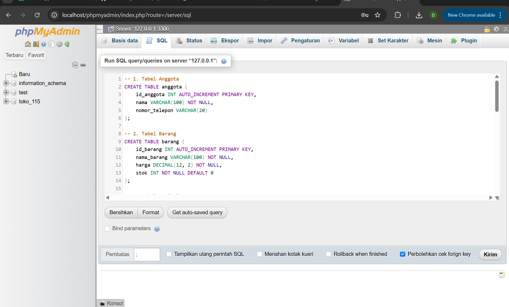
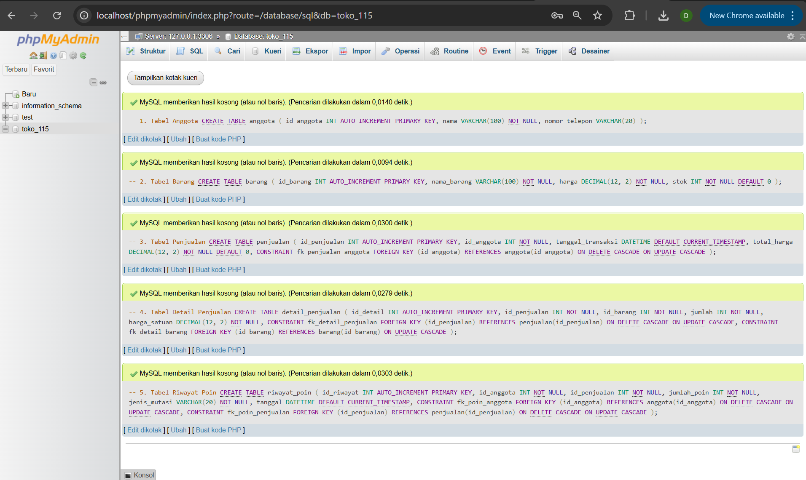
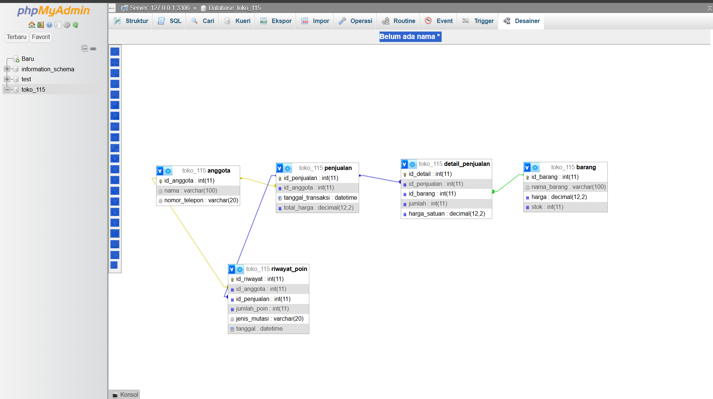
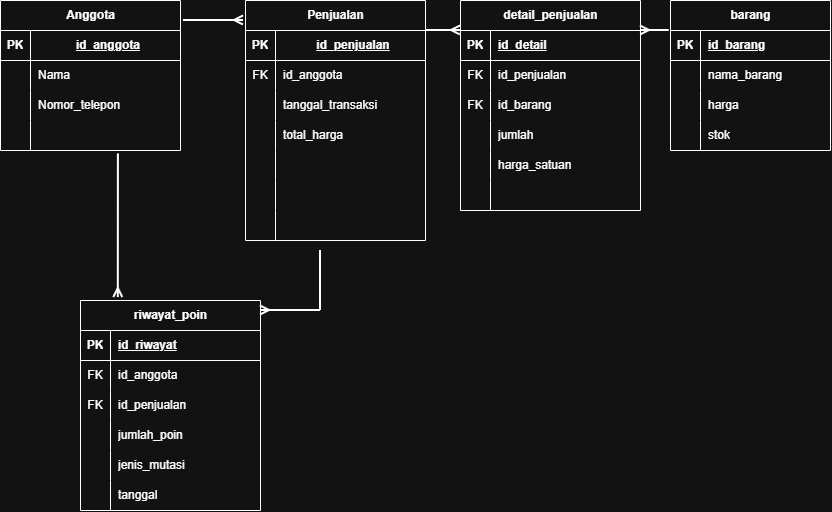

# Laporan Praktikum Basis Data - Pertemuan 03

* **Nama:** Daniel Subing
* **NPM:** 25430115
* **Kelas:** D
* **Pertemuan:** 2
* **Tanggal Pelaksanaan:** 4 Oktober 2026
* **Dosen Pengampu:** Dedi Irawan, S.Kom., M.T.I.

## 1. Tujuan Praktikum
1. Mampu merancang Entity Relationship Diagram (ERD) konseptual berdasarkan dokumen kebutuhan data proyek Toko Daring.
2. Mampu memodelkan relasi kardinalitas antarentitas secara tepat menggunakan notasi baku.
3. Mampu menyelesaikan masalah relasi many-to-many ($M:N$) dengan menerapkan entitas asosiatif.
4. Mampu mengimplementasikan skema relasi fisik ke database MySQL `toko_115` menggunakan phpMyAdmin.

## 2. Ringkasan Dasar Teori
* **Entity Relationship Diagram (ERD):** Model konseptual grafis yang menggambarkan struktur logis basis data, entitas, atribut, dan relasi antarentitas.
* **Kardinalitas Relasi:** Menentukan batasan jumlah keterhubungan instans antar entitas (misal $1:1$, $1:N$, atau $M:N$).
* **Entitas Asosiatif:** Entitas yang digunakan untuk memecah relasi banyak-ke-banyak ($M:N$) menjadi dua relasi satu-ke-banyak ($1:N$), sekaligus berfungsi menyimpan atribut transaksional yang melekat pada kejadian relasi tersebut.
* **Integritas Referensial & Foreign Key:** Kunci asing yang memastikan data yang direferensikan pada tabel anak selalu valid dan merujuk secara konsisten ke tabel induk.

## 3. Hasil Langkah Percobaan
### A. Pembuatan Skema Tabel DDL pada phpMyAdmin
Pembuatan 5 tabel utama (`anggota`, `barang`, `penjualan`, `detail_penjualan`, `riwayat_poin`) pada database `toko_115` menggunakan akun `mhs_115`.

*Gambar 3.1: Kueri skrip DDL SQL pada tab SQL phpMyAdmin sebelum dieksekusi.*

*Gambar 3.2: Notifikasi eksekusi sukses dan daftar 5 tabel yang terbentuk di basis data toko_115.*

### B. Verifikasi Skema Relasi Fisik
Pemeriksaan keterhubungan *foreign key* antartabel pada menu Desainer phpMyAdmin.

*Gambar 3.3: Tampilan visual relasi antartabel pada phpMyAdmin Desainer.*

## 4. Jawaban Titik Analisis
* **Pemisahan Entitas Transaksi dan Detail:** Pemisahan tabel menjadi `penjualan` (header nota) dan `detail_penjualan` (baris item belanja) wajib dilakukan agar sistem mendukung transaksi yang membeli lebih dari satu varian barang tanpa terjadi perulangan kolom atau redundansi data.
* **Pencatatan Riwayat Poin:** Pembuatan entitas terpisah `riwayat_poin` menjamin integritas data sistem loyalitas karena setiap penambahan poin selalu terikat dengan audit log transaksi penjualan terkait.

## 5. Hasil Latihan dan Modifikasi
### 1. Analisis Kebutuhan Poin Loyalitas
* **Keputusan:** Perlu entitas terpisah bernama `riwayat_poin`, tidak cukup hanya menjadi atribut pada entitas `anggota`.
* **Alasan:**
  1. Jika poin hanya menjadi atribut saldo di tabel `anggota`, sistem kehilangan jejak riwayat mutasi (kapan poin bertambah/berkurang dan dari nota transaksi mana poin tersebut dihasilkan).
  2. Entitas `riwayat_poin` mencatat riwayat transaksi secara detail (`id_anggota`, `id_penjualan`, `jumlah_poin`, `jenis_mutasi`, `tanggal`), sehingga mendukung transparansi audit data transaksi.

### 2. Analisis Relasi Penjualan–Barang Banyak-ke-Banyak (M:N) Langsung
* **Data yang Hilang:**
  * Atribut kuantitas pembelian (`jumlah`).
  * Atribut harga jual riil saat kejadian belanja (`harga_satuan`).
  * Subtotal per barang.
* **Alasan:** Relasi $M:N$ fisik tanpa tabel perantara tidak memiliki tempat untuk menyimpan data atribut transaksional per item belanjaan tanpa melanggar aturan normalisasi.

## 6. Tugas Mandiri: Milestone Proyek NN
### A. Diagram ERD Proyek Toko Daring

*Gambar 6.1: ERD Konseptual p03_erd_25430115.png.*
* Berkas mentah: `p03_erd_25430115.drawio`
* Berkas gambar: `p03_erd_25430115.png`

### B. Tabel Relasi dan Kardinalitas

| Kode AB | Entitas Asal | Kardinalitas | Entitas Tujuan | Deskripsi Aturan Bisnis |
| :--- | :--- | :---: | :--- | :--- |
| **AB-01** | `anggota` | $1 : N$ | `penjualan` | Setiap anggota dapat melakukan banyak transaksi penjualan. |
| **AB-02** | `penjualan` | $1 : N$ | `detail_penjualan` | Satu transaksi penjualan memuat satu atau banyak barang belanjaan. |
| **AB-03** | `barang` | $1 : N$ | `detail_penjualan` | Satu jenis barang dapat tercatat di banyak baris detail penjualan. |
| **AB-04** | `anggota` | $1 : N$ | `riwayat_poin` | Setiap anggota dapat memiliki banyak riwayat mutasi poin loyalitas. |
| **AB-05** | `penjualan` | $1 : N$ | `riwayat_poin` | Setiap transaksi penjualan dapat menghasilkan catatan penambahan poin. |

### C. Tabel Penelusuran Kebutuhan Informasi (KI) ke Jalur ERD

| Kode KI | Kebutuhan Informasi | Jalur Entitas / Atribut pada ERD |
| :--- | :--- | :--- |
| **KI-01** | Mengetahui riwayat belanja anggota beserta nominal transaksi. | `anggota` $\rightarrow$ `penjualan` (`id_anggota`, `total_harga`, `tanggal_transaksi`) |
| **KI-02** | Mengetahui rincian barang, jumlah, dan harga satuan dalam suatu transaksi. | `penjualan` $\rightarrow$ `detail_penjualan` $\rightarrow$ `barang` (`id_penjualan`, `id_barang`, `jumlah`, `harga_satuan`) |
| **KI-03** | Mengetahui perolehan dan riwayat mutasi poin anggota dari transaksi. | `anggota` $\rightarrow$ `riwayat_poin` $\rightarrow$ `penjualan` (`id_anggota`, `jumlah_poin`, `jenis_mutasi`, `tanggal`) |

### D. Penerapan Entitas Asosiatif
* **Nama Entitas:** `detail_penjualan`
* **Atribut Mandiri:** `id_detail` (PK), `id_penjualan` (FK), `id_barang` (FK), `jumlah`, `harga_satuan`.

### E. Catatan Tinjauan Klien (Peer Review)
1. **Umpan Balik 1:** Perlu pencatatan riwayat poin secara terpisah agar tidak hanya menimpa saldo akhir.  
   * **Keputusan:** Diterima. Telah dibuat entitas `riwayat_poin`.
2. **Umpan Balik 2:** Atribut harga satuan harus disimpan pada tabel detail penjualan untuk mengantisipasi perubahan harga master di masa depan.  
   * **Keputusan:** Diterima. Telah ditambahkan atribut `harga_satuan` pada entitas asosiatif `detail_penjualan`.

## 7. Pembahasan dan Kendala
* **Pembahasan:** Perancangan ERD telah berhasil diwujudkan ke dalam skema fisik basis data `toko_115` dengan 5 tabel relasional yang saling terhubung menggunakan batasan integritas *primary key* dan *foreign key*.
* **Kendala:** Pengaturan tata letak tabel pada phpMyAdmin Desainer membutuhkan penataan manual agar alur garis relasi kunci tidak saling tumpang-tindih.

## 8. Kesimpulan
1. Pemodelan ERD konseptual pada Modul 3 berhasil diselesaikan dan diimplementasikan ke database `toko_115` menggunakan hak akses `mhs_115`.
2. Relasi banyak-ke-banyak ($M:N$) antara entitas `penjualan` dan `barang` berhasil dipecah menggunakan entitas asosiatif `detail_penjualan` tanpa kehilangan data kuantitas dan harga transaksi.
3. Kebutuhan pencatatan poin loyalitas berhasil diakomodasi melalui entitas log `riwayat_poin`.

## 9. Pernyataan Penggunaan AI
Laporan dan perancangan skema ini disusun secara mandiri dengan bantuan Gemini AI sebagai sarana diskusi konseptual, asistensi sintaksis DDL SQL, dan pengecekan kerapian format laporan.

## 10. Bukti Git
* **Tautan Repositori:** https://github.com/DanielSubing/Toko-Daring
* **Hash Commit:** [Jalankan 'git log -1 --format="%h"' di terminal dan tempel hash-nya di sini]

## Checklist

### Checklist Umum Laporan Praktikum (Tabel P.13)

| Butir | Yang Harus Ada | Status |
| :--- | :--- | :---: |
| **Identitas** | Nama, NIM, kelas, pertemuan ke-N, tanggal pelaksanaan, nama asisten/dosen | [x] |
| **Tujuan** | Tujuan praktikum ditulis ulang dengan bahasa sendiri (maksimal 5 baris) | [x] |
| **Ringkasan teori** | Pemahaman sendiri atas Dasar Teori, maksimal setengah halaman, tanpa menyalin buku | [x] |
| **Langkah percobaan (D)** | Tangkapan layar hasil langkah kunci sesuai checklist khusus, masing-masing diberi keterangan singkat | [x] |
| **Titik Analisis** | Semua Titik Analisis dijawab lengkap dengan alasan, bukan sekadar ya/tidak | [x] |
| **Latihan (E)** | Skrip/dokumen hasil latihan beserta bukti berjalan | [x] |
| **Tugas Mandiri (F)** | Milestone proyek pertemuan ini: berkas, bukti, dan penjelasan keputusan desain | [x] |
| **Pembahasan dan kendala** | Galat yang ditemui, cara membacanya, dan cara mengatasinya | [x] |
| **Kesimpulan** | Dua sampai empat kalimat dengan bahasa sendiri | [x] |
| **Pernyataan Penggunaan AI** | Alat yang dipakai, untuk apa, bagian mana; tulis "tidak menggunakan" bila tidak memakai | [x] |
| **Bukti Git** | Tautan repositori dan kode *commit* (hash) pertemuan ini dengan pesan `pNN: ...` | [x] |
| **Keaslian** | Setiap tangkapan layar memperlihatkan akun ber-NIM dan jam sistem; nama objek memuat NIM/inisial | [x] |

---

### Checklist Khusus Laporan Pertemuan 3 (Tabel 3.4)

| Jenis | Yang Harus Ada | Status |
| :--- | :--- | :---: |
| **Berkas wajib** | `p03_erd_kopma_<NIM>` dan `p03_erd_<NIM>` (gambar + berkas sumber diagram) | [x] |
| **Bukti tangkapan layar** | ERD di draw.io dengan kardinalitas terbaca; catatan tinjauan klien | [x] |
| **Analisis wajib** | Pemetaan setiap entitas ke PB/KI dari Pertemuan 2; alasan kardinalitas relasi utama | [x] |